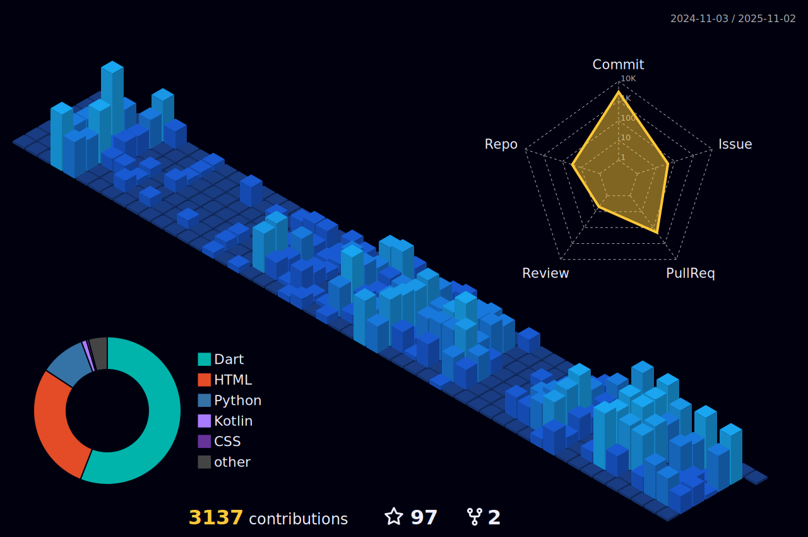

<!--suppress HtmlDeprecatedAttribute -->

## 🛠️ Tech Stack

### Core Mobile App Development

### Data Management & Backend

### Additional Technologies & Languages

 

## 📂 Key Projects

### 📱 Mobile Applications

| Project | Description | Tech Stack |
|---------|-------------|------------|
| [ShareLingo](https://github.com/zero-to-one-flutter/flutter-share-lingo) | Language Exchange Social Media App | `Flutter` `Clean Architecture` `Google OAuth` `CI/CD` `Firebase` `Riverpod` |
| [Cooki](https://github.com/flutter-fantastic-four/cooki-app) | AI Recipe Community App | `Flutter` `Gemini API` `Dio` `Cloud Functions` `Riverpod` `MVVM` `Firestore` |
| [Cubadebate](https://github.com/daehan-lim/cubadebate-app) | Personalized News Platform | `Android` `Kotlin` `Coroutines` `MVVM` `Room` `Retrofit` `Glide` `Lottie` `ViewBinding` |
| [FilmMind](https://github.com/daehan-lim/flutter-film-mind-app) | Movie Information App | `Flutter` `Riverpod` `Dio` `Clean Architecture` `GitHub Actions` `TMDB API` |
| [PlaceFinder](https://github.com/daehan-lim/flutter-place-finder) | Location Search App | `Flutter` `Geolocator` `InAppWebView` `Naver API` `VWorld API` `Riverpod` |
| [Gas Consumption Manager](https://github.com/daehan-lim/gas-consumption-manager) | Public Utility Tracking System | `Android` `Kotlin` `Jetpack` `Room` `MVVM` `Coroutines` `VideoView` |
| [ACME](https://github.com/daehan-lim/acme) | Field Service Management Solution | `Android` `Kotlin` `Room` `Google Maps API` `Calendar Provider API` `MVVM` `Coroutines` |
| [LangMate](https://github.com/daehan-lim/langmate-app) | Language Partner Matching Chat App | `Flutter` `Riverpod` `Firebase Auth` `Firestore` `Geolocator` `Google OAuth` `Dio` |
| [Yellow Pages](https://github.com/daehan-lim/cuban-yellow-pages) | Cuban Phone Directory App | `Android` `Java` `VTM Maps` `SQLite` `WebView` `JUnit` `Apache HTTP` |
| [Government Portal App](https://github.com/daehan-lim/government-portal-app) | Official Government Platform Application | `Android` `Kotlin` `Retrofit` `Coroutines` `Room` `MVVM` `WebView` `ViewPager2` |

### 🔬 Machine Learning Systems

| Project | Description | Tech Stack |
|---------|-------------|------------|
| [Federated Learning Random Forest](https://arxiv.org/abs/2407.19193) | Privacy-Preserving Distributed Learning System | `Python` `NumPy` `Pandas` `scikit-learn` `Matplotlib` `multiprocessing`|
| [RoBERTa News Classifier](https://github.com/daehan-lim/roberta-sport-news-classifier) | Topic Classification Model Enhanced with Synthetic Data | `Python` `PyTorch` `Hugging Face Transformers` `GPT-4` `Streamlit` |
| [Medical Data Classification System](https://github.com/daehan-lim/associative-classifier-mortality-prediction) | Patient Mortality Prediction System | `Python` `NumPy` `Pandas` `scikit-learn` `Jupyter` |

 

## 📊 GitHub Stats

<table align="center">
  <tr>
    <td>
      
    </td>
    <td>
      
    </td>
  </tr>
</table>

 

 
